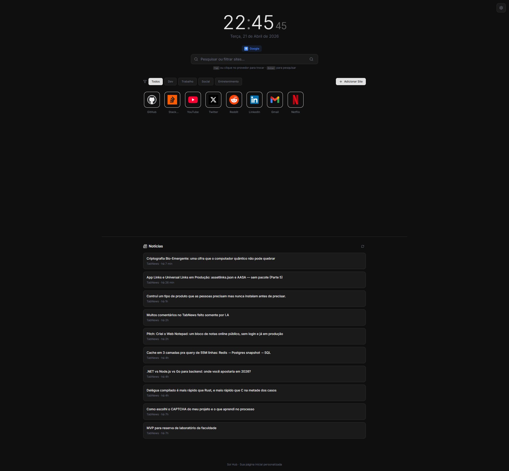

  

# Sol Hub

**Sua página inicial, do seu jeito.**

Sol Hub é uma página inicial personalizada para seu navegador. Rápida, bonita, sem contas, sem complicação. Apenas você e seus sites favoritos.

> **Aviso de Fork:** Este projeto é uma versão derivada de Orbit, criado por Matheusz Nied.
> A base original foi adaptada e personalizada por Douglas Silva.
> Licença original preservada conforme MIT.

---

## Preview

  
  

---

## Por que usar?

**Você abre o navegador dezenas de vezes por dia.** Cada vez é a mesma história: digitar o mesmo site, fazer a mesma pesquisa, perder tempo.

Sol Hub resolve isso colocando tudo que você precisa a um clique de distância. Seus sites favoritos, suas categorias, seu estilo.

### Para usuários:

- **Organize seus sites** - Agrupe por categorias (Dev, Trabalho, Social, Entretenimento...) e encontre o que precisa instantaneamente
- **Pesquise mais rápido** - Vários provedores de busca com um toque (Google, DuckDuckGo, YouTube, Ecosia)
- **Personalize o visual** - 7 temas únicos, do minimalista ao cyberpunk
- **Feed de notícias** - Fique atualizado com tópicos que interessam a você
- **Chat de IA Integrado** - Converse com ChatGPT nativamente, protegido por criptografia de ponta a ponta local
- **Sincronização em Nuvem** - Faça backup e restaure seus dados em qualquer dispositivo usando uma Senha Mestra
- **Sem cadastro** - Tudo salvo localmente, sem contas, sem rastreamento
- **Leve suas configurações** - Exporte e importe seu setup em JSON

### Para recrutadores:

Este projeto demonstra competência em:

- **React moderno** - Hooks, Context, componentização limpa
- **Estado global** - Zustand para gerenciamento eficiente
- **UX/UI** - Interface intuitiva com micro-interações e animações suaves
- **Performance** - Vite para build instantâneo, zero bibliotecas pesadas
- **Responsividade** - Funciona perfeitamente em qualquer tela
- **Persistência e Cloud** - `localStorage` + Neon DB (PostgreSQL) via Netlify Functions (Serverless)
- **Drag & Drop** - dnd-kit para reordenação fluida
- **Segurança** - Criptografia AES-256 no client-side para proteção de API Keys (OpenAI)
- **Temas dinâmicos** - CSS variables para troca de temas sem reload

---

## Funcionalidades

### Relógio e Data

Exibição em tempo real com formato localizado em português. Simples, elegante, sempre visível.

### Barra de Pesquisa Inteligente

- Pressione `Tab` para alternar entre 6 provedores de busca
- Digite para filtrar seus sites simultaneamente
- Pressione `Enter` para pesquisar

### Cards de Sites

- Adicione quantos sites quiser
- Arraste e solte para reorganizar
- Favicon automático via Google S2
- Edite ou remova com um clique

### Categorias Personalizadas

- Crie suas próprias categorias
- Filtre seus sites instantaneamente
- Organize por contexto: trabalho, lazer, estudos...

### Feed de Notícias

- RSS gratuito integrado em tempo real (via proxy serverless, sem limites de cache)
- Suporte a GNews API para mais fontes
- Escolha tópicos: tecnologia, ciência, negócios...

### IA e Sincronização Segura

- Traga sua própria chave da **OpenAI** e converse com o ChatGPT nativamente.
- Sua chave é criptografada no seu navegador (AES-256) atrelada à sua **Senha Mestra**. Ninguém, nem mesmo o servidor, pode lê-la.

### 7 Temas Únicos

| Tema          | Descrição                                    |
| ------------- | -------------------------------------------- |
| Minimal Light | Clássico, limpo, profissional                |
| Minimal Dark  | Escuro elegante, perfeito para programadores |
| Space         | Fundo escuro com estrelas animadas           |
| Hacking       | Matrix-inspired, verde neon em terminal      |
| Nord          | Paleta escandinava suave                     |
| Sunset        | Tons quentes de pôr do sol                   |
| Cyberpunk     | Neon vibrante, futurista                     |

### Export/Import

Exporte toda sua configuração (sites, categorias, tema) em um arquivo JSON. Importe em outro dispositivo e tenha tudo exatamente igual.

---

## Começando

### Usuários

1. Clone o repositório
2. Execute `npm install`
3. Execute `npm run dev`
4. Configure seu navegador para abrir `http://localhost:5173`

### Deploy (Gratuito)

**Netlify/Vercel** - Conecte seu repositório, deploy automático em segundos.

**GitHub Pages** - Hospedagem gratuita diretamente do seu repositório.

---

## Tecnologias

| Tecnologia   | Uso                     |
| ------------ | ----------------------- |
| React 18     | Interface do usuário    |
| Vite         | Build tool ultrarrápido |
| Tailwind CSS | Estilização             |
| Zustand      | Estado global           |
| dnd-kit      | Drag and drop           |
| Lucide React | Ícones                  |

---

## Filosofia

- **Privacidade** - Seus dados ficam no seu navegador
- **Sem contas** - Não precisa se cadastrar em nada
- **Sem backend** - Funciona offline, 100% client-side
- **Sem dependências pesadas** - Build leve, carregamento instantâneo
- **Open source** - Código aberto, contribuições bem-vindas

---

## Licença

Este projeto é uma versão derivada de Orbit, criado por Matheusz Nied. A base original foi adaptada e personalizada por Douglas Silva. Licença original preservada conforme MIT.

---

**Adaptado com cuidado por Douglas Silva**

